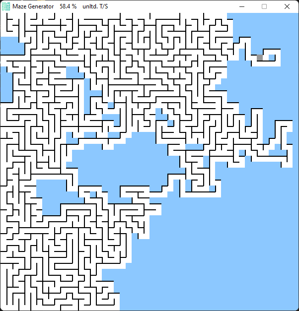

# Maze Generator

Maze generator made with `Pygame` library in `Python 3`!

---

### How to use

- To generate a maze, just open the `maze.exe` application. You don't need to install anything, since the application is a stand-alone program
- Use `Up` and `Down` arrow buttons to change the generation speed (min 10t/s, max 100t/s or unltd.t/s)
- Press `Spacebar` to pause/resume the generation
- Press `Enter` to reset and restart the generation

---

---

### Requirements

- Nothing is required for the Maze Generator application to work, but for development purposes you will need:
  * `Python 3` You can download Python from [here](https://www.python.org/downloads/)
  * `Pygame` You can find download instructions for the module from [here](https://github.com/pygame/pygame)'

---

# License
- This repository is licensed with MIT-license. To learn more about the MIT-license, check out [this](https://en.wikipedia.org/wiki/MIT_License) webpage.

---